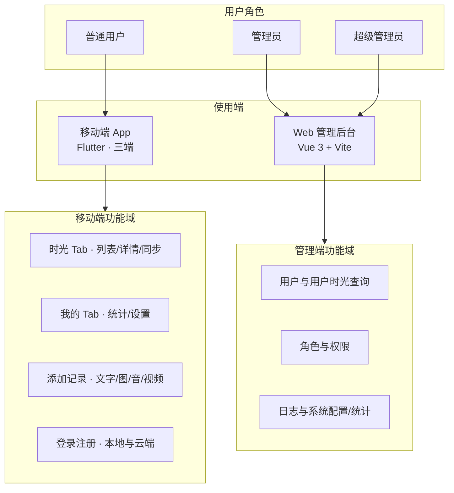
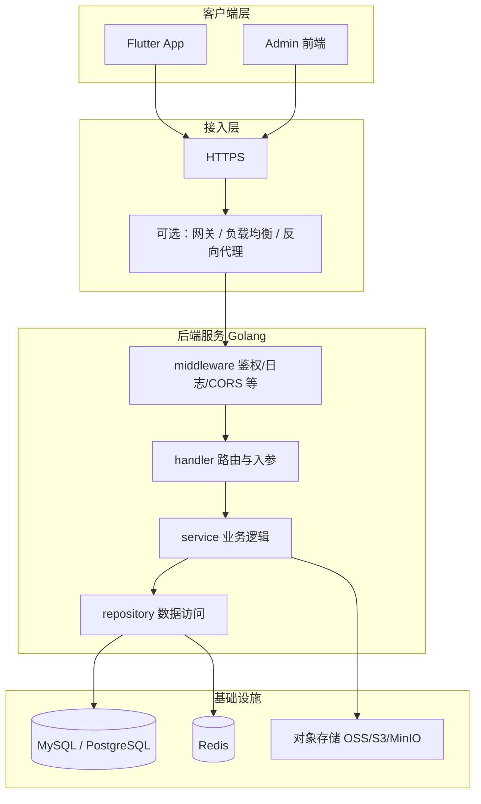
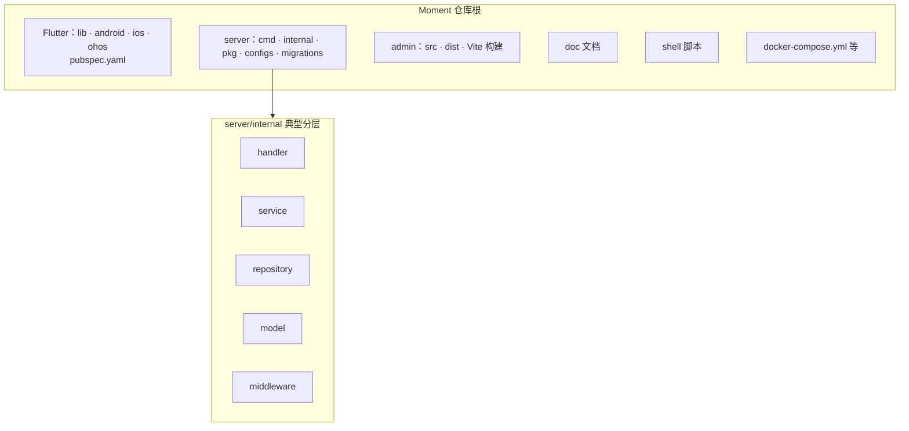

# 拾光记 (Moment) - 需求与开发文档

---

## 一、需求文档

### 1.1 产品概述

**拾光记 (Moment)** 是一款生活记录类 App，帮助用户以文字、图片、音频、视频等多种形式记录生活点滴，留住美好时光。

| 项目 | 说明 |
|------|------|
| 中文名 | 拾光记 |
| 英文名 | Moment |
| 产品定位 | 个人生活记录工具 |
| 目标用户 | 希望记录日常生活的个人用户 |

### 1.2 用户角色

| 角色 | 说明 | 使用端 |
|------|------|--------|
| 普通用户 | 使用 App 记录生活 | 移动端 (Flutter) |
| 管理员 | 管理用户、系统配置 | Web 后台 |
| 超级管理员 | 角色、权限、日志等全量管理 | Web 后台 |

### 1.3 功能需求

#### 1.3.1 移动端 (App)

**1. 底部 Tab 导航**

| 需求项 | 描述 | 优先级 |
|--------|------|--------|
| Tab 数量 | 固定 2 个 Tab：「时光」「我的」 | P0 |
| 切换方式 | 仅支持点击切换，不支持滑动 | P0 |
| Tab 位置 | 固定在底部 | P0 |

**2. 时光 Tab**

| 需求项 | 描述 | 优先级 |
|--------|------|--------|
| 记录列表 | 展示所有记录，按时间倒序 | P0 |
| 单条展示 | 每条显示：文案摘要、创建时间 | P0 |
| 交互 | 点击任意记录进入详情页 | P0 |
| 刷新 | 支持下拉刷新 | P1 |
| 分页/加载 | 支持上拉加载更多（数据量大时） | P1 |

**3. 我的 Tab**

| 需求项 | 描述 | 优先级 |
|--------|------|--------|
| 统计 | 记录总数、按类型统计（文字/图片/音频/视频） | P0 |
| 设置入口 | 账号、通知、隐私等设置 | P0 |
| 扩展 | 预留后续功能入口 | P1 |

**4. 记录详情页**

| 需求项 | 描述 | 优先级 |
|--------|------|--------|
| 内容展示 | 完整文案、全部媒体内容 | P0 |
| 图片 | 支持多图展示、可缩放 | P0 |
| 音频 | 支持播放、暂停、进度条 | P0 |
| 视频 | 支持播放、暂停 | P0 |
| 编辑/删除 | 支持编辑、删除记录 | P1 |

**5. 添加记录**

| 需求项 | 描述 | 优先级 |
|--------|------|--------|
| 文字 | 支持纯文字输入 | P0 |
| 图片 | 相册选择、拍照，支持多图 | P0 |
| 音频 | 录音并保存 | P0 |
| 视频 | 相册选择、录像 | P0 |
| 混合 | 支持文字 + 多种媒体组合 | P0 |

**6. 用户与数据**

| 需求项 | 描述 | 优先级 |
|--------|------|--------|
| 登录/注册 | 支持账号登录、注册 | P0 |
| 数据同步 | 记录云端同步（登录后） | P0 |
| 离线 | 未登录或离线时可本地存储 | P1 |

#### 1.3.2 Web 后台管理系统

| 模块 | 功能点 | 优先级 |
|------|--------|--------|
| 用户管理 | 用户列表、新增、编辑、禁用、删除 | P0 |
| 用户时光查询 | 按用户查看其全部时光记录（管理端列表/筛选/详情）；详见 [admin_user_moments_query.md](./admin_user_moments_query.md) | P0 |
| 角色管理 | 角色列表、权限分配 | P0 |
| 权限管理 | 菜单/按钮级权限配置 | P0 |
| 日志管理 | 操作日志、登录日志、审计日志 | P0 |
| 系统配置 | 系统参数、字典配置 | P1 |
| 数据统计 | 用户数、记录数等概览 | P1 |

### 1.4 非功能需求

| 类型 | 要求 |
|------|------|
| 多端兼容 | Android、iOS、鸿蒙 3 端，默认 Android 编译 |
| 跨平台后端 | 支持 Linux、Windows、macOS 部署 |
| 响应时间 | 接口 P95 < 500ms |
| 安全 | HTTPS、JWT 鉴权、敏感数据加密 |
| 可维护性 | 模块化、清晰目录结构、必要注释 |

### 1.5 数据需求

| 数据类型 | 说明 |
|----------|------|
| 记录 | 文案、时间、媒体类型、媒体路径/URL |
| 用户 | 账号、密码（加密）、昵称、头像等 |
| 媒体 | 图片、音频、视频文件存储 |
| 日志 | 操作、登录、异常等日志 |

---

## 二、开发文档

### 2.1 技术架构总览

```
┌─────────────────────────────────────────────────────────────────┐
│                        用户层                                     │
├─────────────────┬─────────────────┬─────────────────────────────┤
│   Android App    │    iOS App      │   鸿蒙 App    │  Web 管理端  │
│   (Flutter)      │   (Flutter)     │  (Flutter)    │  (Vue/React) │
└────────┬─────────┴────────┬────────┴───────┬───────┴──────┬──────┘
         │                  │                │              │
         └──────────────────┼────────────────┼──────────────┘
                            │   HTTPS        │
                            ▼                ▼
┌─────────────────────────────────────────────────────────────────┐
│                      API 网关 / 负载均衡                          │
└─────────────────────────────────────────────────────────────────┘
                            │
                            ▼
┌─────────────────────────────────────────────────────────────────┐
│                    后端服务 (Golang)                              │
│  ┌──────────┐ ┌──────────┐ ┌──────────┐ ┌──────────────────┐   │
│  │ 用户模块  │ │ 记录模块  │ │ 媒体模块  │ │ 权限/日志模块    │   │
│  └──────────┘ └──────────┘ └──────────┘ └──────────────────┘   │
└─────────────────────────────────────────────────────────────────┘
         │                  │                │
         ▼                  ▼                ▼
┌──────────────┐  ┌──────────────┐  ┌──────────────────┐
│   MySQL/     │  │  对象存储     │  │   Redis (缓存)    │
│   PostgreSQL │  │  (OSS/S3)    │  │                   │
└──────────────┘  └──────────────┘  └──────────────────┘
```

### 2.1.1 项目层级架构

以下从**角色与端 → 系统技术分层 → 仓库与后端内部分层**概括全项目结构，与 §1.2、§1.3、§2.3 一致。**Flutter 工程位于仓库根目录**（`lib/`、`android/`、`ios/`、`ohos/`），与下文 §2.3 目录树一致。

#### 角色、端与功能域



#### 系统技术分层（调用与数据流）



#### 仓库目录与后端内部分层



```text
Moment/
├── lib/                    # Flutter 源码（ screens / providers / services / models …）
├── android/
├── ios/
├── ohos/
├── server/
│   ├── cmd/server/         # 入口 main
│   ├── internal/           # handler → service → repository、model、middleware
│   ├── pkg/                # jwt、response、config 等可复用包
│   ├── configs/            # 配置 YAML
│   └── migrations/         # SQL 迁移
├── admin/                  # 管理端 Vue 源码与构建产物
├── doc/                    # 项目文档
├── shell/                  # 本地启动与运维脚本（可选）
└── docker-compose.yml      # MySQL、Redis 等（见 §2.7）
```

### 2.2 技术选型

#### 2.2.1 移动端 (Flutter)

| 类别 | 技术 | 版本 | 说明 |
|------|------|------|------|
| 框架 | Flutter | 3.22.1-ohos-1.0.1 | 鸿蒙兼容版 |
| 状态管理 | Provider / Riverpod | - | 轻量状态管理 |
| 网络 | dio | ^5.x | HTTP 客户端 |
| 本地存储 | sqflite + shared_preferences | - | 离线缓存、配置 |
| 图片 | image_picker、cached_network_image | - | 选择、缓存 |
| 音频 | record、audioplayers | - | 录音、播放 |
| 视频 | video_player | - | 视频播放 |
| 权限 | permission_handler | - | 相机、麦克风等 |
| 路由 | go_router | - | 声明式路由 |

#### 2.2.2 后端 (Golang)

| 类别 | 技术 | 说明 |
|------|------|------|
| 框架 | Gin / Echo / Fiber | RESTful API |
| ORM | GORM | 数据库操作 |
| 数据库 | MySQL 8 / PostgreSQL | 主库 |
| 缓存 | Redis | 会话、热点数据 |
| 对象存储 | MinIO / 阿里云 OSS / AWS S3 | 图片、音视频 |
| 鉴权 | JWT (golang-jwt/jwt) | Token 认证 |
| 配置 | Viper | 配置管理 |
| 日志 | zap / logrus | 结构化日志 |

#### 2.2.3 Web 管理端

| 类别 | 技术 | 说明 |
|------|------|------|
| 框架 | Vue 3 + Vite | 或 React 18 + Vite |
| UI 库 | Element Plus / Ant Design Vue | 后台组件 |
| 状态 | Pinia / Zustand | 全局状态 |
| 路由 | Vue Router / React Router | 路由 |
| 请求 | axios | HTTP |
| 构建 | Vite | 构建工具 |

#### 2.2.4 基础设施

| 类别 | 技术 | 说明 |
|------|------|------|
| 容器化 | Docker + Docker Compose | 开发统一提供 MySQL/Redis；可选全栈容器 |
| 反向代理 | Nginx / Caddy | 生产环境 |
| CI/CD | GitHub Actions / GitLab CI | 自动化构建 |

### 2.3 目录结构

#### 2.3.1 项目根目录

本仓库 **Flutter 在仓库根目录**（无单独 `app/` 子目录）；下列树与 §2.1.1 一致。

```
moment/
├── lib/                    # Flutter 移动端源码
├── android/
├── ios/
├── ohos/
├── pubspec.yaml
├── server/                 # Golang 后端
│   ├── cmd/
│   ├── internal/
│   ├── pkg/
│   ├── configs/
│   ├── go.mod
│   └── main.go
├── admin/                  # Web 管理端
│   ├── src/
│   ├── package.json
│   └── vite.config.ts
├── doc/                    # 文档
├── shell/                  # 启动与运维脚本（可选）
├── docker-compose.yml      # 开发依赖容器（根目录）
└── admin/Dockerfile 等     # 按需的镜像定义
```

#### 2.3.2 后端 (server/) 详细结构

```
server/
├── cmd/
│   └── server/
│       └── main.go
├── internal/
│   ├── handler/            # HTTP 处理器
│   │   ├── user.go
│   │   ├── moment.go
│   │   └── auth.go
│   ├── service/            # 业务逻辑
│   ├── repository/         # 数据访问
│   ├── model/              # 数据模型
│   └── middleware/         # 中间件（鉴权、日志等）
├── pkg/
│   ├── jwt/
│   ├── response/
│   └── validator/
├── configs/
│   └── config.yaml
└── migrations/             # 数据库迁移
```

#### 2.3.3 Flutter (lib/) 详细结构

```
lib/
├── main.dart
├── app.dart
├── config/
│   └── env.dart
├── models/
│   ├── moment_record.dart
│   └── user.dart
├── providers/
│   ├── auth_provider.dart
│   └── moment_provider.dart
├── services/
│   ├── api_service.dart
│   ├── database_service.dart
│   └── storage_service.dart
├── screens/
│   ├── home_screen.dart
│   ├── moments_tab.dart
│   ├── my_tab.dart
│   ├── add_moment_screen.dart
│   └── moment_detail_screen.dart
├── widgets/
└── utils/
```

### 2.4 API 设计

#### 2.4.1 接口规范

- **Base URL**: `https://api.example.com/v1`
- **认证**: Header `Authorization: Bearer <token>`
- **格式**: JSON
- **错误码**: 统一格式 `{ "code": 0, "msg": "", "data": {} }`

#### 2.4.2 核心接口

| 方法 | 路径 | 说明 |
|------|------|------|
| POST | /auth/register | 注册 |
| POST | /auth/login | 登录 |
| POST | /auth/refresh | 刷新 Token |
| GET | /users/me | 当前用户信息 |
| GET | /moments | 记录列表（分页） |
| POST | /moments | 创建记录 |
| GET | /moments/:id | 记录详情 |
| PUT | /moments/:id | 更新记录 |
| DELETE | /moments/:id | 删除记录 |
| POST | /upload | 媒体上传（返回 URL） |
| GET | /stats | 统计（我的 Tab） |

### 2.5 数据库设计

#### 2.5.1 核心表

**users**
| 字段 | 类型 | 说明 |
|------|------|------|
| id | bigint PK | |
| username | varchar(64) | 唯一 |
| password_hash | varchar(255) | |
| nickname | varchar(64) | |
| avatar_url | varchar(512) | |
| status | tinyint | 0禁用 1正常 |
| created_at | datetime | |
| updated_at | datetime | |

**moments**
| 字段 | 类型 | 说明 |
|------|------|------|
| id | bigint PK | |
| user_id | bigint FK | |
| content | text | 文案 |
| media_type | varchar(20) | text/image/audio/video/mixed |
| media_paths | text | JSON 或逗号分隔 URL |
| created_at | datetime | |
| updated_at | datetime | |

**roles / permissions / user_roles**（RBAC 标准设计）

**operation_logs**
| 字段 | 类型 | 说明 |
|------|------|------|
| id | bigint PK | |
| user_id | bigint | |
| action | varchar(64) | |
| module | varchar(64) | |
| detail | text | |
| ip | varchar(64) | |
| created_at | datetime | |

### 2.6 多端兼容要点

| 平台 | 注意点 |
|------|--------|
| Android | 权限申请、存储路径、后台限制 |
| iOS | 隐私描述、相册/相机权限、沙盒 |
| 鸿蒙 | ohos 配置、API 差异、构建流程 (hvigor) |

- 使用 `Platform.isAndroid / isIOS` 或条件导入处理平台差异
- 媒体路径统一使用 `path_provider` 等跨平台 API
- 测试时在三端分别验证核心流程

### 2.7 部署方案

**约定：开发机安装 Docker（含 Compose v2）**，用 Compose 统一提供 **MySQL、Redis**；后端与前端工具链仍在宿主机运行（调试体验一致）。仓库根目录 **`docker-compose.yml`**、**`.env.example`**；后端默认 **`server/configs/config.yaml`**，仅当连接信息与默认不符时用 **`server/configs/config.local.yaml`**（已 `.gitignore`）。环境变量覆盖见 `server/pkg/config/config.go`。

#### 2.7.1 标准开发流（各设备相同）

1. 仓库根目录：`cp .env.example .env`（可按需改端口/密钥；团队可共用默认值做本地联调）
2. `docker compose up -d mysql redis`，等待 MySQL healthy（首次会自动执行 `server/migrations` 初始化）
3. `cd server && go run ./cmd/server`
4. `cd admin && npm run dev`（Vite 代理本机 `8080`）
5. `cd app && flutter run …`（按需）

**全栈容器**（联调部署形态）：`cd admin && npm run build` 后，仓库根执行 `docker compose up -d`，由容器跑 `server` + Nginx 托管 `admin/dist`。

#### 2.7.2 场景对照

| 场景 | MySQL / Redis | API / 调试 |
|------|---------------|------------|
| **日常开发（默认）** | `docker compose up -d mysql redis` | 宿主机 `go run` + `npm run dev` |
| **全栈 Docker** | Compose 管理 | `docker compose up -d`，容器内 `DATABASE_HOST=mysql` 等 |

**例外（无 Docker 或必须连外部库）**：自行准备 MySQL 8 + Redis，并配置 **`config.local.yaml`**（或环境变量），必要时手动执行 `server/migrations/001_init.sql`。

**默认账号与端口（与 compose / `config.yaml` 对齐；生产勿用默认密钥入库）：**

| 项 | 默认值 |
|----|--------|
| 库名 | `moment` |
| 应用用户 | `moment` / `moment_password` |
| MySQL root（容器内管理） | `root_password`（`.env`） |
| 后端 HTTP | `8080` |
| Redis | `localhost:6379`（无密码） |

#### 2.7.3 命令速查

```bash
# 依赖（每次开机或克隆仓库后）
docker compose up -d mysql redis

cd server && go run ./cmd/server
cd admin && npm run dev
cd app && flutter run -d android
```

更细的排错与验证见 **`doc/moment_debug.md`**。

### 2.8 开发流程与规范

| 项目 | 说明 |
|------|------|
| 分支 | main（生产）、develop（开发）、feature/* |
| 提交 | Conventional Commits（feat/fix/docs 等） |
| 代码风格 | Go: gofmt；Dart: dart format；前端: ESLint + Prettier |
| 文档 | 重要改动同步 README；API 使用 OpenAPI/Swagger |

---

*文档版本：1.3 | 更新日期：2026-03*
